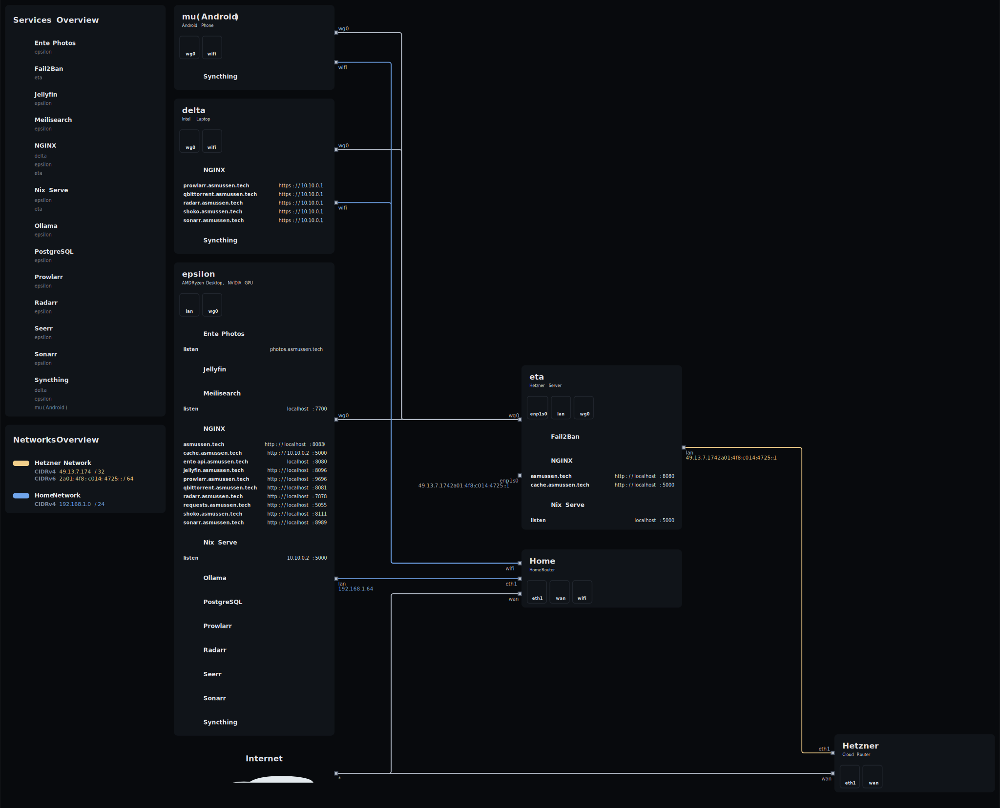

# dotfiles

This is a repository for my NixOS configuration.

## Topology



## Table of Contents

- [Installation Guide](#installation-guide)
- [Maintenance Guide](#maintenance-guide)
- [To-Do Tracking](#to-do-tracking)
- [Development Templates](#development-templates)

## Installation Guide

### Boot Medium

You can boot from the custom ISO which comes with Git, my custom Neovim build,
and flakes pre-enabled.

Download the latest pre-built ISO from the
[Releases](https://github.com/BastianAsmussen/dotfiles/releases/latest) page,
or build it locally:

```sh
just iso
```

Then write it to a flash drive:

```sh
just iso-install /dev/sdX
```

> [!NOTE]
> If you don't have the custom ISO, a standard NixOS installer works too. You
> will just need to enter a Nix shell with Git first:
>
> ```sh
> nix-shell -p git
> ```

### Steps

1. Clone the Git repository.

   ```sh
   git clone https://github.com/BastianAsmussen/dotfiles.git ~/dotfiles
   cd ~/dotfiles
   ```

2. Enter the provided Nix development shell.

   ```sh
   nix develop
   ```

> [!NOTE]
> On a standard NixOS installer without flakes enabled, use the compatibility
> shell instead:
>
> ```sh
> nix-shell --experimental-features 'nix-command flakes'
> ```

1. Choose a host.
   1. View available host options.

      ```sh
      HOSTNAME=$(ls modules/nixosModules/hosts | fzf)
      ```

   2. Set manually, e.g. `lambda`.

      ```sh
      HOSTNAME=lambda
      ```

2. Set up the disk configuration.

   ```sh
   just disko $HOSTNAME
   ```

3. Finally, install NixOS with the given configuration.

   ```sh
   just install $HOSTNAME
   ```

### Possible Errors and Workarounds

- `error: creating pipe: Too many open files`

  Simply increase the open file limit, i.e. setting it to `2048`.

  ```sh
  ulimit -n 2048
  ```

- `warning: download buffer is full; consider increasing the 'download-buffer-size' setting`

  It's worth to consider increasing the download buffer during installation.
  Like the warning suggests, this can be accomplished by increasing the
  `download-buffer-size` setting; pass `--option download-buffer-size n` where
  `n` is the buffer size to the `just install` command from step 3.

> [!IMPORTANT]
> Remember to change the password of the user!

## Maintenance Guide

1. I recommend updating the [flake.lock](./flake.lock) file about once per week.

   ```sh
   just upgrade
   ```

> [!NOTE]
> If it can't build, roll back the [flake.lock](./flake.lock) file to a
> previous version.  
> Running `git restore flake.lock` should be sufficient.

### Rename Host

1. Move the host directory, e.g. `lambda` -> `epsilon`.

   ```sh
   mv modules/nixosModules/hosts/lambda modules/nixosModules/hosts/epsilon
   ```

2. Switch to new configuration.

   ```sh
   just rebuild epsilon
   ```

> [!WARNING]
> The hostname won't update automatically!  
> To update the hostname, either reboot the computer, or restart the current session.

## To-Do Tracking

I track stuff I need to get done and stuff that annoys me about my current
setup in a file called [TODO.md](./TODO.md).  
If you have suggestions or notice something that could be improved, feel free
to open a pull request. I'll review and consider integrating your
contributions.

## Development Templates

You can use this flake for development environment templates.

### List Templates

```sh
nix-shell -p jq --run "nix flake show self --json 2>/dev/null | jq '.templates | map_values(.description) | del(.default)'"
```

### Use Template

> [!NOTE]
> Because we override the [Nix registry](https://nix.dev/manual/nix/2.18/command-ref/new-cli/nix3-registry#description)  
> [here](./modules/nixos/nix/default.nix), we can simply use the `self` registry
> entry which references this flake.

### Rust Example

```sh
mkdir ~/Projects/example
cd ~/Projects/example

nix flake init -t self#rust
./init.sh
```
