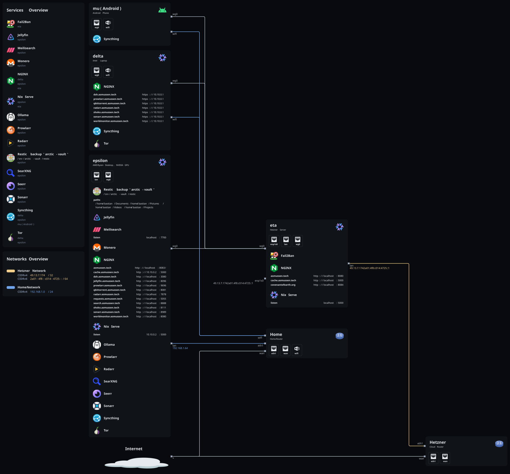

# dotfiles

This is a repository for my NixOS configuration.

## Topology



## Table of Contents

- [Installation Guide](#installation-guide)
  - [LUKS & FIDO2](#luks--fido2)
  - [Age Key Generation (sops-nix)](#age-key-generation-sops-nix)
  - [Lanzaboote / Secure Boot (UEFI)](#lanzaboote--secure-boot-uefi)
- [Maintenance Guide](#maintenance-guide)
- [To-Do Tracking](#to-do-tracking)
- [Development Templates](#development-templates)

## Installation Guide

### Boot Medium

You can boot from the custom ISO which comes with Git, my custom Neovim build,
and flakes pre-enabled.

Download the latest pre-built ISO from the
[Releases](https://codeberg.org/BastianA/dotfiles/releases/latest) page,
or build it locally:

```sh
just iso
```

Then write it to a flash drive:

```sh
just iso-install /dev/sdX
```

> [!NOTE]
> If you don't have the custom ISO, a standard NixOS installer works too. You
> will just need to enter a Nix shell with Git first:
>
> ```sh
> nix-shell -p git
> ```

### Steps

1. Clone the Git repository.

   ```sh
   git clone https://codeberg.org/BastianA/dotfiles.git ~/dotfiles
   cd ~/dotfiles
   ```

2. Enter the provided Nix development shell.

   ```sh
   nix develop
   ```

> [!NOTE]
> On a standard NixOS installer without flakes enabled, use the compatibility
> shell instead:
>
> ```sh
> nix-shell --experimental-features 'nix-command flakes'
> ```

1. Choose a host.
   1. View available host options.

      ```sh
      HOSTNAME=$(ls modules/nixosModules/hosts | fzf)
      ```

   2. Set manually, e.g. `delta`.

      ```sh
      HOSTNAME=delta
      ```

2. Set up the disk configuration.

   ```sh
   just disko $HOSTNAME
   ```

3. Install NixOS with the given configuration.

   ```sh
   just install $HOSTNAME
   ```

4. Reboot, then finish the post-install steps that cannot be done
   declaratively:
   - [Enroll a FIDO2 token](#enrolling-a-fido2-token) if the host uses LUKS.
   - [Set up Secure Boot](#lanzaboote--secure-boot-uefi) if the host imports
     `lanzaboote` (`epsilon`). **Skipping this leaves the machine running an
     unsigned boot chain**, which is the whole point of importing the module.

### Possible Errors and Workarounds

- `error: creating pipe: Too many open files`

  Simply increase the open file limit, i.e. setting it to `2048`.

  ```sh
  ulimit -n 2048
  ```

- `warning: download buffer is full; consider increasing the 'download-buffer-size' setting`

  It's worth to consider increasing the download buffer during installation.
  Like the warning suggests, this can be accomplished by increasing the
  `download-buffer-size` setting; pass `--option download-buffer-size n` where
  `n` is the buffer size to the `just install` command from step 3.

### LUKS & FIDO2

Hosts with LUKS-encrypted disks (e.g. `epsilon`, `delta`) use
`fido2-device=auto` in their disko configs so the LUKS volume can be unlocked
with a FIDO2 token (such as a YubiKey) instead of typing a passphrase.

#### Enrolling a FIDO2 Token

FIDO2 tokens are **not** enrolled automatically! You must enroll them manually
after installation. Without enrollment the `Tokens:` section in `luksDump` will
be empty and the system will fall back to a password prompt.

```sh
# Main disk (contains root filesystem).
just fido2-enroll /dev/nvme0n1p3

# Extra disk (marked nofail, won't block boot).
just fido2-enroll /dev/nvme1n1p1
```

You can verify enrollment succeeded:

```sh
sudo cryptsetup luksDump /dev/nvme0n1p3 | grep -A5 'Tokens'
```

A successfully enrolled token will show a `systemd-fido2` entry under
`Tokens:` instead of an empty section.

#### Partition Labels

Disko generates systemd units that reference disks by GPT partition label
(e.g. `/dev/disk/by-partlabel/disk-extra-luks`). If a disk was partitioned
outside of disko the label may not exist and systemd will time out waiting for
it at boot.

To fix this, set the label manually (non-destructive, only changes the GPT
name, not data):

```sh
# For the extra NVMe:
sudo sgdisk -c 1:disk-extra-luks /dev/nvme1n1
```

#### Non-Essential Disks & `nofail`

The extra NVMe (`extra_lvm`) and backup (`/dev/sda`) volumes are marked with
`nofail` in both their crypttab and mount options. This means:

- If the disk is missing or its partition label doesn't exist, boot continues
  normally instead of hanging for 90 seconds and failing.
- The main disk (`luks_lvm`) intentionally does **not** have `nofail` because
  it contains `/`, `/nix`, and `/home`.

### Age Key Generation (sops-nix)

This config uses [sops-nix](https://github.com/Mic92/sops-nix) with
[age](https://github.com/FiloSottile/age)-format keys to manage secrets. There
are two kinds of access keys:

- **User key**: A standalone key for editing and maintaining `secrets.yaml`
  from any machine.
- **Host key**: Derived from the host's SSH ed25519 key so `sops-nix` can
  decrypt secrets during NixOS builds.

#### Generate a Standalone User Key

Create a personal age key at the default path `sops-nix` looks for:

```sh
just age-keygen
```

The public key is printed to the terminal. Back up the contents of `keys.txt`
somewhere safe (e.g. a password manager).

To re-print the public key later:

```sh
age-keygen -y ~/.config/sops/age/keys.txt
```

#### Derive a Host Key from SSH

Each NixOS host already has an SSH host key created when `openssh` is enabled.
Derive an age public key from it:

```sh
just age-host-key
```

> [!NOTE]
> The sops module in this config (`modules/nixosModules/features/sops.nix`)
> already points `sops.age.sshKeyPaths` at `/etc/ssh/ssh_host_ed25519_key` and
> sets `generateKey = true`, so the private side is handled automatically at
> activation time.

#### Register Keys in `.sops.yaml`

Add the public keys to the `.sops.yaml` file in your secrets repository:

```yaml
keys:
  - &user_alice age1xxxxxxxxxxxxxxxxxxxxxxxxxxxxxxxxxxxxxxxxxxxxxxxxxxxxxxxx
  - &host_kappa age1yyyyyyyyyyyyyyyyyyyyyyyyyyyyyyyyyyyyyyyyyyyyyyyyyyyyyyyy

creation_rules:
  - path_regex: secrets\.yaml$
    key_groups:
      - age:
          - *user_alice
          - *host_kappa
```

After updating `.sops.yaml`, re-encrypt `secrets.yaml` so the new keys can
access it:

```sh
sops updatekeys secrets.yaml
```

### Lanzaboote / Secure Boot (UEFI)

Hosts that import `self.nixosModules.lanzaboote` (e.g. `epsilon`) use
[Lanzaboote](https://github.com/nix-community/lanzaboote) to sign the UEFI boot
chain with [sbctl](https://github.com/Foxboron/sbctl), protecting against
evil-maid attacks. The module automatically disables the stock systemd-boot
installer — do not enable both.

Note that `delta` uses [Limine](https://limine-bootloader.org) rather than
Lanzaboote, so none of this applies there.

#### Post-Install Setup

Secure Boot keys are **not** created automatically, and nothing in the
configuration can create them for you: enrolling into firmware needs the
machine to be in Setup Mode. Do this once, after the first boot into the
installed system.

1. Put the firmware into Setup Mode. This lives in the UEFI menu, usually under
   *Security -> Secure Boot -> Key Management*, as "Erase all Secure Boot
   settings", "Delete all keys", or "Clear Secure Boot keys". Leave Secure Boot
   itself **disabled** for now.

2. Confirm the machine is actually in Setup Mode before going further:

   ```sh
   just secureboot-verify
   ```

   `Setup Mode` must read `Enabled`. If it reads `Disabled`, the firmware did
   not clear its keys and `enroll-keys` below will fail.

3. Create the keys and enroll them:

   ```sh
   just secureboot-setup
   ```

   This runs `sbctl create-keys` (PK, KEK and db under `/var/lib/sbctl`), then
   `sbctl enroll-keys --microsoft`. Keep `--microsoft`: without the vendor
   certificates, firmware that verifies its own option ROMs (most discrete GPUs
   and some NVMe drives) will refuse to initialise them.

4. Rebuild so the current generation is signed with the new keys, then reboot:

   ```sh
   just rebuild
   sudo reboot
   ```

5. Re-enable Secure Boot in the UEFI menu, boot, and check:

   ```sh
   just secureboot-verify
   ```

   `Secure Boot` should read `Enabled` and every file in the `sbctl verify`
   output should be marked as signed. Unsigned entries are usually stale
   generations; they disappear once garbage-collected.

#### Ongoing

After any rebuild you can re-check the chain:

```sh
just secureboot-verify
```

> [!WARNING]
> `lanzaboote.nix` declares `/var/lib/sbctl` as persisted state, so on a
> tmpfs-root host the keys survive a reboot without the host having to list
> them. If you ever move the `pkiBundle` path, move that declaration with it:
> keys that vanish leave the next rebuild unable to sign the boot chain, and
> the machine unbootable.

> [!TIP]
> If you end up in that state, boot the installer ISO, disable Secure Boot in
> firmware, and rebuild. The generation will boot unsigned, and you can redo
> the enrollment from step 1.

## Maintenance Guide

1. I recommend updating the [flake.lock](./flake.lock) file about once per week.

   ```sh
   just upgrade
   ```

> [!NOTE]
> If it can't build, roll back the [flake.lock](./flake.lock) file to a
> previous version and rebuild:
>
> ```sh
> just rollback
> ```

> [!TIP]
> The `rebuild` and `upgrade` commands accept extra arguments after the
> hostname. For example, to enable verbose trace output:
>
> ```sh
> just rebuild kappa --show-trace
> ```

### Recipe Reference

| Recipe | Purpose |
| --- | --- |
| `just rebuild` | Rebuild and switch the current host |
| `just upgrade` | Update flake.lock + rebuild |
| `just update [input]` | Update flake.lock without rebuilding |
| `just build <host>` | Build a host without switching |
| `just deploy <host> <target>` | Remote deploy via SSH with password auth |
| `just clean` | Remove old generations (keeps 3, plus 7 days) |
| `just rollback` | Restore flake.lock and rebuild |
| `just check` | Full flake check (statix, deadnix, eval tests, VM tests) |
| `just fmt` | Format all Nix files |
| `just topology` | Regenerate the network diagram (`docs/topology.svg`) |
| `just vault` | Trigger an arctic vault backup snapshot |
| `just infra <args>` | OpenTofu IaC commands (Hetzner Cloud) |

Install and secrets recipes, used once per host rather than day to day:

| Recipe | Purpose |
| --- | --- |
| `just add-host <name>` | Scaffold a new host from `_example` |
| `just disko <host>` | Partition and format disks (**destructive**) |
| `just install <host>` | Run `nixos-install` for a host |
| `just iso` | Build the custom installer ISO |
| `just iso-install <drive>` | Write the latest ISO to a flash drive |
| `just fido2-enroll <device>` | Enroll a FIDO2 token for LUKS |
| `just secureboot-setup` | Create and enroll Secure Boot keys (Lanzaboote) |
| `just secureboot-verify` | Check the boot chain is signed |
| `just age-keygen` | Generate a standalone age key |
| `just age-host-key` | Derive an age key from the host's SSH key |

### Rename Host

1. Move the host directory, e.g. `kappa` -> `sigma`.

   ```sh
   mv modules/nixosModules/hosts/kappa modules/nixosModules/hosts/sigma
   ```

2. Switch to new configuration.

   ```sh
   just rebuild sigma
   ```

> [!WARNING]
> The hostname won't update automatically!  
> To update the hostname, either reboot the computer, or restart the current session.

### Add Host

1. Scaffold a new host from the minimal template.

   ```sh
   just add-host zeta
   ```

2. Edit `modules/nixosModules/hosts/zeta/configuration.nix` to add the
   modules and settings your new machine needs (hardware config, desktop,
   features, etc.). See [`epsilon`](./modules/nixosModules/hosts/epsilon/configuration.nix)
   or [`delta`](./modules/nixosModules/hosts/delta/configuration.nix) for reference.

3. Build and switch to the new host.

   ```sh
   just rebuild zeta
   ```

## To-Do Tracking

I track stuff I need to get done and stuff that annoys me about my current
setup with [Tuxedo](https://github.com/webstonehq/tuxedo) in
[todo.txt](./todo.txt).  
If you have suggestions or notice something that could be improved, feel free
to open a pull request. I'll review and consider integrating your contributions.

## Development Templates

You can use this flake for development environment templates.

### List Templates

```sh
just show-templates
```

### Use Template

> [!NOTE]
> Because we override the [Nix registry](https://nix.dev/manual/nix/2.18/command-ref/new-cli/nix3-registry#description)  
> [here](./modules/nixosModules/features/nix.nix), we can simply use the `self` registry
> entry which references this flake.

### Rust Example

```sh
mkdir ~/Projects/example
cd ~/Projects/example

nix flake init -t self#rust
./init.sh
```
